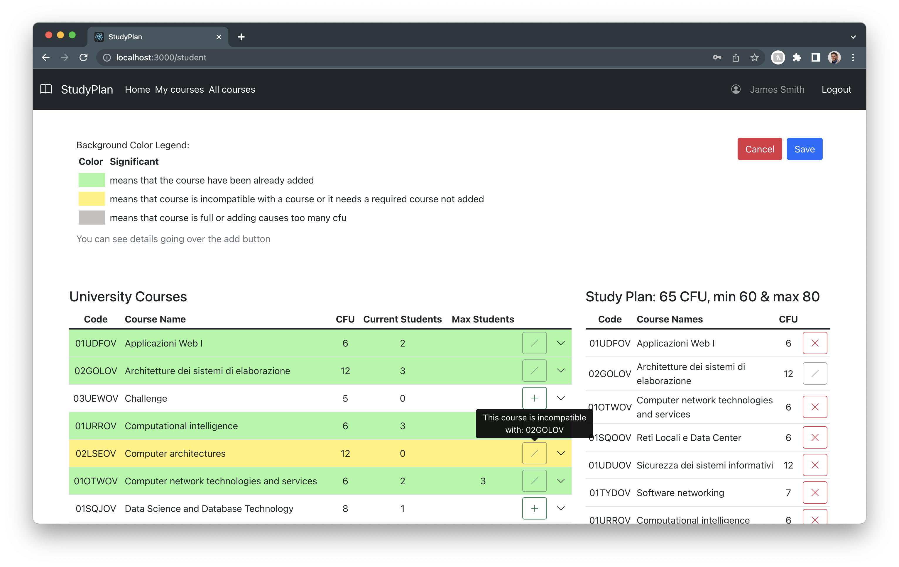

# Exam #1: Piano di Studi
## Student: s295285 LO TRUGLIO SAMUELE 

## React Client Application Routes

- Route `/`: initial page
- Route `/login`: login page
- Route `/allCourses`: anonymous home page with all courses
- Route `/student`: home page logged in
- Route `/student/courses`: page with all student's study plan courses
- Route `/401`: page with 401 error
- Route `/404`: page with 404 error

## API Server

- POST `/api/sessions`
  - request body: `email`, `password`
  - response code: `200`
  - response body content: user info
  - error response code: `401`
- GET `/api/sessions/current`
  - request body: `None`
  - response code: `200`
  - response body content: user info
  - error response code: `401` if not logged in
- DELETE `/api/sessions/current`
  - request body: `None`
  - response code: `200`
- GET `/api/courses`
  - request parameters: `None`
  - response code: `200`
  - response body content: array of all courses. Each course has: id, name, cfu, actualS, maxS (if any), required (if any), incompatibles (if any) (example below)
    ```
    [
      {
        "id":  "05BIDOV",
        "name": "Ingegneria del Software",
        "cfu": 6,
        "actualS": 4,
        "required": "02GOLOV",
        "incompatibles": [
          "04GSPOV"
        ]
      },
      ...
    ]
    ```
  - error response code: `500` if an error occurred
- GET `/api/studyPlan`
  - request body: `None`
  - response code: `200`
  - response body content: studentId, studyPlanType (full-time or part-time), minCfu, maxCfu, actualCfu (example below)
    ```
    {
      "studentId": "1",
      "studyPlanType": "full-time",
      "minCfu": 60,
      "maxCfu": 80,
      "actualCfu": 65
    }
    ```
  - error response codes: `401` if the user is not logged in, `404` if there is no study plan for the user, `500` if an error occurred
- GET `/api/studyPlan/courses`
  - request body: `None`
  - response code: `200`
  - response body content: array of student's studyplan courses. (example below)
    ```
    [
      {
        id: '01SQOOV',
        name: 'Reti Locali e Data Center',
        cfu: 6,
        required: '',
        maxS: '',
        actualS: 1
      },
      {
        id: '01TYDOV',
        name: 'Software networking',
        cfu: 7,
        required: '',
        maxS: '',
        actualS: 1
      },
      ...
    ]
    ```
  - error response codes: `401` if the user is not logged in, `500` if an error occurred
- POST `/api/studyPlan`
  - request body content: studyPlanType, minCfu, maxCfu, actualCfu, courses (example below)
    ```
    {
      "studyPlanType": "part-time",
      "minCfu": 20,
      "maxCfu": 40,
      "actualCfu": 24,
      "courses": [
          "02GOLOV",
          "05BIDOV",
          "01UDFOV"
          ]
    }
    ```
  - response code: `201`
  - error response codes: `401` if the user is not logged in, `422` if the body content format is not valid, `400` if body content is not valid, `404` if there is a course id not found, `409` if exist a studyplan for the user, `500` if an error occurred
- PUT `/api/studyPlan/courses`
  - request body content: studyPlanType, minCfu, maxCfu, actualCfu, courses (example below)
    ```
    {
      "studyPlanType": "part-time",
      "minCfu": 20,
      "maxCfu": 40,
      "actualCfu": 24,
      "courses": [
          "02GOLOV",
          "05BIDOV",
          "01UDFOV"
          ]
    }
    ```
  - response code: `200`
  - error response codes: `401` if the user is not logged in, `422` if the body content format is not valid, `400` if body content is not valid, `404` if there is a course id not found, `500` if an error occurred
- DELETE `/api/studyPlan`
  - request body: `None`
  - response code: `204`
  - error response codes: `500` if an error occurred
  
## Database Tables

*Primary keys are in bold and underlined.*

- Table `COURSE` - contains course id, course name, course cfu, course max students if any, actual students and the required course id *(corso propedeutico)* (if any) as follows 
  - (<ins>**id**</ins>, name, cfu, maxS, actualS, required)
- Table `INCOMPATIBILITY` - contains ids of courses that are incompatible 
  - (<ins>**course1**</ins>, <ins>**course2**</ins>)
- Table `USER` - contains user id, user name, user surname, user email, user hashed password, user salt as follows 
  - (<ins>**id**</ins>, name, surname, email, hash, salt)
- Table `STUDYPLAN` - contains student id, type of study plan (as boolean if TRUE full-time else part-time), min and max cfu for the study plan type, actual cfu as follows 
  - (<ins>**student**</ins>, fulltime, minCfu, maxCfu, actualCfu)
- Table `STUDYPLAN_COURSE` - contains student id and course id as follows
  - (<ins>**student**</ins>,<ins>**course**</ins>)
  

Foreign keys:
- `STUDYPLAN.student` references `USER.id`
- `STUDYPLAN_COURSE.student` references `USER.id`
- `STUDYPLAN_COURSE.course` references `COURSE.id`
  
Unique:
- `USER.email`

Not Null:
- `COURSE.name`
- `COURSE.cfu`
- `USER.name`
- `USER.surname`
- `USER.email`

Check:
- `COURSE.maxS` >= `COURSE.actualS`
- `COURSE.actualS` >= 0

## Main React Components
All the components listed below are in the folder: `client/src/components/`
- `Layout` (in `Layout.js`): component that displays the navigation bar (with Login and Logout buttons) and the variable content of the page (the page is loaded in the browser using the `<Route>` component)
- `Login` (in `Login.js`): component that displays a login form
- `CourseView` (in `Courses.js`): component that displays all courses passed as props with their info (id, name, cfu, max students, current students, incompatible courses and required course _(corso propedeutico)_ if any)
- `HomeLoggedIn` (in `HomeLogged.js`): logged user home page with other components that let the user to manage his study plan
- `UniversityCourse` (in `StudyPlanCourses.js`): component that displays as a row the information about a course passed as props. It is used in `<UniversityCourseTable>` and it also contains a logic to change the color and the buttons based on other courses (it's similar to `<LocalStudyPlanCourse>`)
- `LocalStudyPlanTable` (in `StudyPlanCourses.js`): component that displays a table with a row `<LocalStudyPlanCourse>` for each course in the study plan of the user (it's similar to `<UniversityCourseTable>`)
- `StudyPlanCard` (in `StudyPlan.js`): component that displays a card with actual number of CFU of the student and two buttons: one to delete the study plan and another to edit the study plan
- `CreateCard` (in `StudyPlan.js`): component that displays a card with a button to create a new study plan. It opens `<CreateModal>` to choose the type of study plan


(only _main_ components, minor ones may be skipped)

## Screenshot



## Users Credentials

| email   | password | name    | surname  | Study Plan |
| :------ | :------- | :------ | :------- | :--------: |
| u1@d.it | password | James   | Smith    | Full Time  |
| u2@d.it | pwd      | Michael | Brown    | Part Time  |
| u3@d.it | password | John    | Williams | Part Time  |
| u4@d.it | pwd      | Robert  | Jones    | Full Time  |
| u5@d.it | password | David   | Garcia   |    None    |
